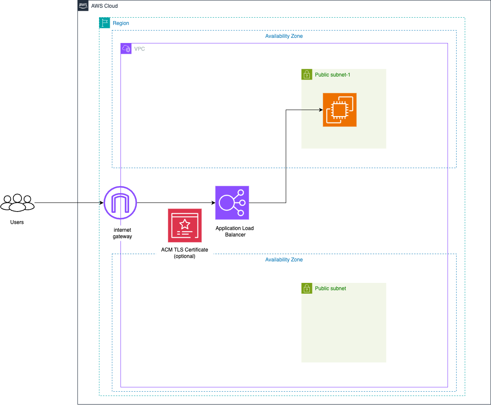

# Dify-EC2-CDK-Blueprint

Deploy [Dify](https://dify.ai/), an LLM app development platform, on AWS using **EC2** and **AWS CDK**.  
This blueprint focuses on a **simple** EC2-based deployment, fronted by an Application Load Balancer (ALB).

## Architecture Overview

Below is the AWS architecture for this deployment:



By default, this project creates:

- A new **VPC** with two **public subnets** (configurable CIDRs).
- One **EC2 instance** running Amazon Linux 2023.
  - Docker and Docker Compose are installed via user data.
  - Dify is cloned from GitHub and automatically started.
- An **Application Load Balancer** (ALB) to route traffic to the EC2 instance.
- (Optional) An **HTTPS** listener if you provide a valid AWS Certificate Manager (ACM) certificate ARN.

```
[Client] --> [ALB:80 or 443] --> [EC2 + Dify Containers]
```

### Key Features

- **Single EC2 Instance**: Great for testing or light production workloads.
- **Minimal AWS Overhead**: No extra managed services are used in this blueprint.
- **Easy to Extend**: You can modify the user data script or Docker Compose configuration.
- **HTTPS-Ready**: Supply an ACM certificate ARN to enable SSL/TLS.

---

## Prerequisites

1. **Node.js** (v18 or newer)
2. **AWS CLI** (configured with credentials that can create VPCs, EC2, ALB, etc.)
3. **AWS CDK** (v2 or newer)
4. **Docker** (recommended if you want to test container builds locally — but not required for deployment)
5. **An EC2 Key Pair** (if you plan to SSH into the instance)

---

## Getting Started

### 1. Clone the Repository

```bash
git clone https://github.com/kdt-hata/dify-ec2-cdk-blueprint
cd dify-ec2-cdk-blueprint
```

### 2. Install Dependencies

```bash
npm install
```

### 3. Optional: Adjust Configuration

- Open `bin/difyCdk.ts`. The stack expects a **context parameter** called `environment` (e.g., `dev` or `prod`).
- You can also customize or extend these properties:

  - `certificateArn` (optional): If omitted, the ALB will not set up an HTTPS listener.
  - `stackName`: Provide a custom name for the CloudFormation stack if desired.

- Look at the code in `lib/difyCdkStack.ts` to see **CloudFormation Parameters**:
  - `VpcCIDR` (default `192.168.0.0/16`)
  - `Subnet1CIDR` (default `192.168.0.0/20`)
  - `Subnet2CIDR` (default `192.168.16.0/20`)
  - `AllowedCIDR` (default `0.0.0.0/0`)
  - `KeyName` (default `dify-key`)

You can override these parameter values at deploy time with the `--parameters` flag or via a `cdk.json` file.

### 4. Bootstrap Your AWS Environment (One-Time)

If you've never used CDK in your AWS account/region, run:

```bash
cdk bootstrap
```

This sets up the required S3 buckets and roles for CDK deployments.

### 5. Deploy

Deploy with the environment context:

```bash
cdk deploy -c environment=dev
```

- CDK will prompt for the creation/updates of IAM roles.
- After successful deployment, you'll see outputs like:
  - **ALBEndpoint**: the DNS name of the ALB.
  - **InstancePublicIP**: the public IP of the EC2 instance.
  - **InstanceId**: the ID of the created EC2 instance.

### 6. Accessing Dify

- Use the ALB DNS name (e.g. `http://<ALB_ENDPOINT>`) to open the Dify interface.
- If you supplied `certificateArn` and set up Route 53 for your domain, create an A-record that points your domain (e.g. `dify.example.com`) to the ALB. Then access `https://dify.example.com`.

---

## Custom Domain Setup (Optional)

For a custom domain (e.g. `dify.example.com`):

1. Request or import an SSL certificate via [AWS Certificate Manager](https://docs.aws.amazon.com/acm/latest/userguide/gs.html).
2. Pass the certificate ARN to the stack either as an environment variable or a constructor prop (see `certificateArn`).
3. Create a Route 53 A-record that routes to your ALB's DNS name.

---

## SSHing into the EC2 Instance

1. Make sure you have an **EC2 key pair** matching the parameter `KeyName` (default: `dify-key`).
2. Once the stack finishes:
   ```bash
   ssh -i /path/to/dify-key.pem ec2-user@<InstancePublicIP>
   ```
3. Once inside:
   ```bash
   docker ps
   ```
   You should see Dify containers up and running.

---

## Troubleshooting

- **Load Balancer Health Check Fails**

  - Verify that your EC2 instance is running Docker Compose and that the container is listening on port `80`.
  - The user data script installs Docker & Compose, clones Dify, then does `docker-compose up -d`.

- **Parameter Mismatches**

  - Make sure to pass the correct key pair name or IP ranges if you have stricter firewall settings.

- **Route 53 Not Resolving**
  - Confirm that your domain is managed by Route 53 or that your DNS provider's A-record points correctly to the ALB.

---

## Notes

- You can **customize** the `userDataScript` in `EC2InstanceConstruct` (within `lib/constructs/ec2InstanceConstruct.ts`) to adjust how Dify is installed or to run additional commands.
- For larger or production-grade deployments (with managed database, caching, etc.), check out the [aws-samples/dify-self-hosted-on-aws](https://github.com/aws-samples/dify-self-hosted-on-aws) repo for a more robust solution.
- This blueprint uses a **single** EC2 instance. For HA/DR or auto-scaling, you'd need to adapt the stack to either an Auto Scaling Group or ECS/Fargate.

---

## Clean Up

To remove all deployed resources and avoid ongoing costs:

```bash
cdk destroy -c environment=dev
```

- If you used a custom ECR, certificate, or Route 53 records, delete them manually if no longer needed.

---

## License

This project is licensed under the [MIT License](./LICENSE).  
You should also check [Dify's license](https://github.com/langgenius/dify/blob/main/LICENSE) to understand how Dify itself is licensed.

---

## Contributing

Contributions are welcome! Please:

- Read our [CODE_OF_CONDUCT.md](./CODE_OF_CONDUCT.md) for community guidelines.
- Refer to [CONTRIBUTING.md](./CONTRIBUTING.md) for best practices and instructions on how to submit changes.

Thank you for helping us improve this project!
